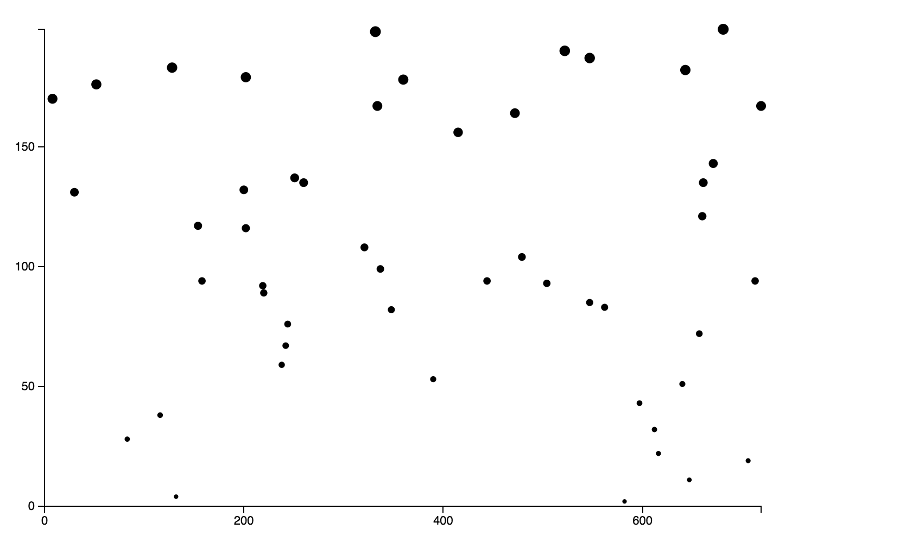
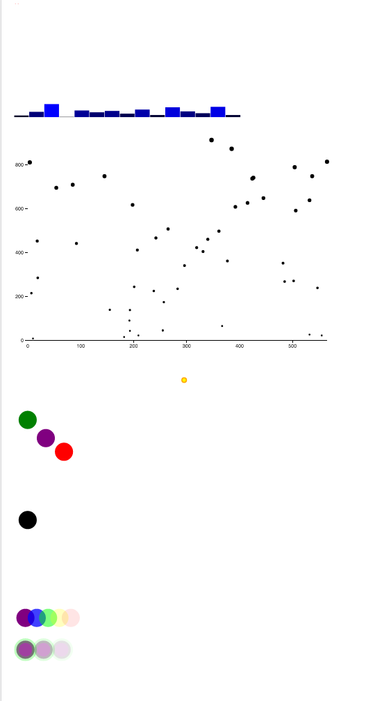

##Scott Murray intro to D3 tutorial

Some reference from dashingd3.js and other alignedleft.com examples also used. This project is intended as a introduction to the D3 library and a reference project for D3 basic syntax going forward.

The tutorial concludes with:
- an svg bar chart (randomized dataset)
- an svg scatterplot (randomized dataset), with scaled axes, points scaled to values, accompanying data labels (commented out but left intact for reference purposes)
- a number of exercises designed to familiarize the user with adding SVG objects to a page

Additionally, looked into transitions, .each and durations at http://alignedleft.com/projects/2014/easy-as-pi/

